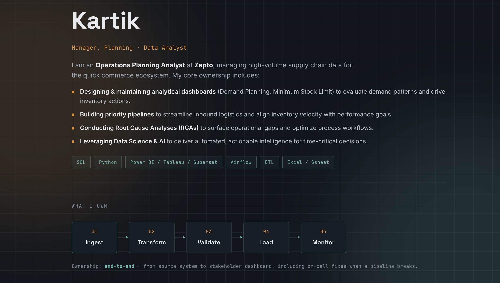

# Kartik — Data Analyst Portfolio

**[2k0v11.github.io](https://2k0v11.github.io/)**

A personal portfolio site for a Manager, Planning Analyst / Data Analyst — built to showcase pipeline ownership, automation projects, and dashboards rather than a generic project grid.


---

## 📸 Preview



---

## ✨ Overview

This site follows a **control-room / monitoring-dashboard** visual style, built specifically around the role: showing pipelines as a live system, not a portfolio grid.

- 🟢 A status line at the top ("systems nominal — pipelines running") sets the tone
- 🔀 A live pipeline-flow diagram (`Ingest → Transform → Validate → Load → Monitor`) as the signature visual
- 📊 Project cards styled like system cards — each with real operational metrics (records/day, uptime, error reduction) instead of generic descriptions
- 🌌 A subtle animated background (drifting grid + soft glows) for depth
- 🎞️ Scroll-triggered reveals and micro-interactions on hover, all respecting `prefers-reduced-motion`
- 📱 Fully responsive, single-file, no build step

## 🛠️ Tech Stack

| Layer | Choice |
|---|---|
| Markup / Styling | Plain HTML5 + CSS (custom properties, no framework) |
| Fonts | [Space Grotesk](https://fonts.google.com/specimen/Space+Grotesk), [Inter](https://fonts.google.com/specimen/Inter), [JetBrains Mono](https://fonts.google.com/specimen/JetBrains+Mono) |
| Interactivity | Vanilla JavaScript (`IntersectionObserver` for scroll reveals) |
| Hosting | [GitHub Pages](https://pages.github.com/) |

No build tools, bundlers, or dependencies — it's a single `index.html` file.

## 📁 Structure

```
2k0v11.github.io/
├── index.html      # entire site — markup, styles, and script in one file
├── resume.pdf       # downloadable resume (linked from the site)
├── assets/
│   └── screenshot.png
└── README.md
```

## 🚀 Running locally

Since it's a static single-file site, no setup is required:

```bash
git clone https://github.com/2k0v11/2k0v11.github.io.git
cd 2k0v11.github.io
open index.html   # or just double-click the file
```

## 🔧 Customizing

All content lives directly in `index.html`:

- **Bio & role** — edit the text inside `<header class="top">`
- **Tech stack tags** — edit the `<div class="stack">` list
- **Pipeline stages** — edit the `.pipeline-flow` stage labels
- **Projects** — duplicate an `<article class="project">` block and update the title, description, metrics, and tags
- **Resume** — replace `resume.pdf` in the repo root with your own file (same filename)
- **Contact links** — update the `<ul class="contact-list">` entries

## 📄 License

Personal portfolio content — feel free to fork the structure/design for your own portfolio, but please swap out the personal content (name, bio, projects, resume) before publishing.

---

Built and maintained by **Kartik** · [LinkedIn](https://www.linkedin.com/in/kavya-kartik-734285246/) · [GitHub](https://github.com/2k0v11)
